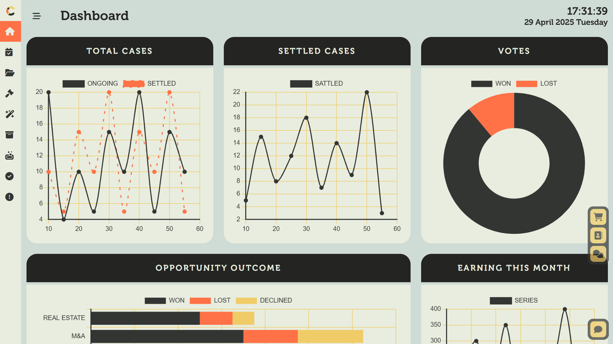
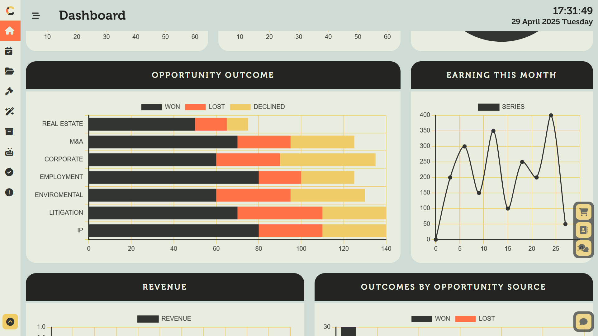

# Case Management System

A simple case management system built with Express.js and MongoDB.  
Supports multi-level authentication & authorization (Admin, User, Judge, Lawyer), features case creation, appointment booking, and beautiful interface with interactive graphs.

## Table of Contents

- [Features](#features)
- [Tech Stack](#tech-stack)
- [Screenshots](#screenshots)
- [Installation](#installation)
- [Running the App](#running-the-app)
- [Contributing](#contributing)
- [License](#license)

## Features

- 🔐 Role-based AuthN & AuthZ (Admin, User, Judge, Lawyer)
- 📋 Create, view, and manage cases
- 📅 Book appointments
- 📈 Interactive graph representations
- ✨ Clean, responsive UI

## Tech Stack

- **Backend:** Express.js
- **Database:** MongoDB
- **Authentication:** JSON Web Tokens
- **Frontend:** EJS templates + Bootstrap

## Screenshots




## Installation

```bash
# Clone the repo and install dependencies
git clone https://github.com/thesujalpatel/CaseManagementSystem.git
cd CaseManagementSystem
npm install
```

## Running the App

```bash
# Start the development server
npm run dev
# Visit http://localhost:3000 in your browser
```

## Contributing

1. Fork the repo
2. Create a new branch (`git checkout -b feature/YourFeature`)
3. Make your changes
4. Commit your changes (`git commit -m 'Add some feature'`)
5. Push to the branch (`git push origin feature/YourFeature`)
6. Open a Pull Request

## License

This project is licensed under the MIT License. see the [LICENSE](LICENSE) file for details.
